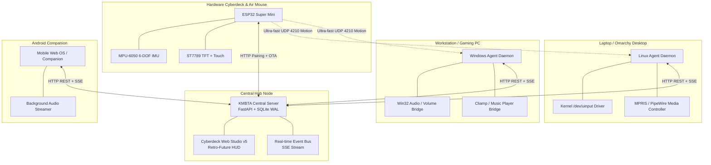

# 🌐 KMBTA Ecosystem — Cyber-Retro Personal Computing & Hardware Matrix

[](LICENSE)
[](#architecture)
[](#tech-stack)
[](README_FA.md)

> **KMBTA** is a self-hosted, cross-device personal operating environment that seamlessly unifies **Linux laptops**, **Windows workstations**, **Android mobile devices**, and **custom ESP32 hardware cyberdecks** into a synchronized cyber-retro command mesh.

[🇮🇷 **نسخه فارسی مستندات (Persian / Farsi Documentation)**](README_FA.md)

---

## 📑 Table of Contents
1. [System Philosophy](#-system-philosophy)
2. [Global Architecture](#-global-architecture)
3. [Ecosystem Nodes & Components](#-ecosystem-nodes--components)
4. [Hardware Cyberdeck & Air Mouse](#-hardware-cyberdeck--air-mouse)
5. [Key Protocols & Capabilities](#-key-protocols--capabilities)
6. [Security & Isolation Model](#-security--isolation-model)
7. [Deployment & Quick Start](#-deployment--quick-start)
8. [License](#-license)

---

## ⚡ System Philosophy

Traditional multi-device ecosystems (like Apple Continuity or KDE Connect) are either locked inside closed proprietary walls or split into disconnected tools. **KMBTA** was designed from the ground up to solve this with four core tenets:

1. **Hardware Independence:** A unified protocol connecting custom microcontrollers (ESP32), Linux (Wayland/Hyprland), Windows, and mobile.
2. **Sub-Millisecond Responsiveness:** Local UDP channels for physical motion (<0.1ms latency) paired with async Server-Sent Events (SSE) for cloud synchronization.
3. **Cyber-Retro Aesthetics:** Inspired by vintage avionics, industrial cyberpunk terminals, and clean telemetry HUDs.
4. **Absolute Privacy:** 100% self-hosted, zero reliance on external cloud services, and full cryptographic PIN-based device pairing.

---

## 🛸 Global Architecture



---

## 📦 Ecosystem Nodes & Components

### 1. 🛰️ Central Server & Cyberdeck Studio
- **Role:** Central telemetry coordinator, automation dispatcher, and media streaming server.
- **Tech:** Python 3.11+, FastAPI, SQLite (WAL mode), Docker Compose.
- **Features:**
  - RESTful APIs covering 40+ endpoints for device lifecycle, remote actions, and streaming.
  - Server-Sent Events (SSE) bus broadcasting state changes to all nodes instantly.
  - High-contrast cyberpunk web interface optimized for both desktop and mobile touch screens.

### 2. 🐧 Linux Agent (Laptop / Desktop)
- **Role:** Native background daemon for Arch Linux / Omarchy / Hyprland Wayland environments.
- **Capabilities:**
  - Kernel-level mouse and keyboard emulation via `/dev/uinput` (zero X11/Wayland dependencies).
  - PipeWire / MPRIS media controller and active window tracking.
  - Hardware health monitoring (battery charge rate, CPU frequency, network status).

### 3. 🪟 Windows Agent (Workstation)
- **Role:** Background automation and audio integration for Windows systems.
- **Capabilities:**
  - Win32 API volume slider control and mute toggling.
  - Universal media bridge interfacing with Cliamp/Winamp and system players.
  - Silent VBS runner and automated startup task scheduler.

### 4. 📱 Android Mobile Companion
- **Role:** Portable media remote and audio handoff player.
- **Capabilities:**
  - Touch-optimized web interface with tactile haptic audio controls.
  - Continuous streaming from central music repository with lockscreen media notifications.

---

## 🎮 Hardware Cyberdeck & Air Mouse

The physical hardware module is a custom handheld cyberdeck built around an **ESP32** and **MPU-6050** 6-DOF IMU.

```
       [ ESP32 Super Mini Microcontroller ]
         │                        │
         ├── (I2C: SDA/SCL) ─────► MPU-6050 6-DOF Gyro / Accel
         │
         ├── (SPI: SCK/MOSI) ────► 240x240 ST7789 Color TFT Display
         │
         ├── (SPI / GPIO) ───────► XPT2046 Resistive Touch Controller
         │
         └── (WiFi 802.11 b/g/n) ─► UDP 4210 (<0.1ms Cursor Motion Stream)
                                 └── HTTP Web OTA (Wireless Firmware Update)
```

### 🎯 True Laser Pointing Mode (Yaw vs Roll)
Unlike basic air mice that uncomfortably bind horizontal cursor movement to wrist twisting (Roll), KMBTA uses a **decoupled pointer engine**:
- **Swiveling Nose Left / Right (`Yaw Z`):** Controls Horizontal Cursor movement (`dx`) naturally like a laser pointer.
- **Tilting Nose Up / Down (`Pitch X`):** Controls Vertical Cursor movement (`dy`).
- **Wrist Roll (`Roll Y`):** Completely decoupled from cursor motion and reserved exclusively for **Flick Gestures**!

### ✋ Motion Flick Macros
- **Sharp Wrist Flick Right:** Skip to Next Track (`CMD:MEDIA_NEXT`)
- **Sharp Wrist Flick Left:** Previous Track (`CMD:MEDIA_PREV`)
- **Sharp Tilt Flick Up:** Volume Up (`CMD:VOL_UP`)
- **Sharp Tilt Flick Down:** Volume Down (`CMD:VOL_DOWN`)

---

## 📡 Key Protocols & Capabilities

### 1. Universal Media Handoff
Allows transferring music playback across nodes with **1 tap** while preserving current timestamp:
```json
{
  "source_device": "kmbta-laptop-01",
  "target_device": "kmbta-windows-pc",
  "track_id": "ambient-session-04",
  "position_sec": 78.4,
  "action": "play"
}
```

### 2. Universal Clipboard Sync
Instant text synchronization across Linux, Windows, and mobile devices:
- Shared clipboard buffer updated via SSE.
- Local clipboard monitors push new copies automatically with deduplication.

### 3. Air Mouse UDP Binary/ASCII Datagrams (Port `4210`)
```text
CMD:MOUSE:<dx>,<dy>     # Relative cursor movement
CMD:CLICK:LEFT          # Mouse clicks
CMD:SCROLL:<delta>      # Vertical scroll
CMD:MEDIA_PLAY_PAUSE    # OS Media Keys
```

---

## 🔒 Security & Isolation Model

- **Zero Plaintext Secrets:** All production repositories use environment variables (`.env`) and `.example` configurations. No API tokens, private IPs, or WiFi passwords are stored in version control.
- **Cryptographic PIN Handshake:** New devices must be authorized via a 6-digit one-time PIN before receiving a scoped `X-Device-Token`.
- **Admin Boundary:** High-privilege tasks (pairing approvals, configuration updates) require a separate 64-character hex `X-KMBTA-Admin` token.
- **Independent Local Network Fallback:** In the event of an external network loss, nodes communicate directly via local UDP broadcast and mDNS.

---

## 🚀 Deployment & Quick Start

### Central Hub (Docker Compose)
```bash
# 1. Clone repository
git clone https://github.com/denkikmbta/kmbta-ecosystem.git
cd kmbta-ecosystem

# 2. Configure environment
cp .env.example .env
# Edit .env and set your KMBTA_ADMIN_TOKEN

# 3. Launch Central Hub
docker compose up -d
```

### Linux Agent
```bash
cd kmbta-linux-agent
./bin/kmbta-airmouse --daemon
```

---

## 📄 License
This project is open-source under the terms of the [MIT License](LICENSE).
